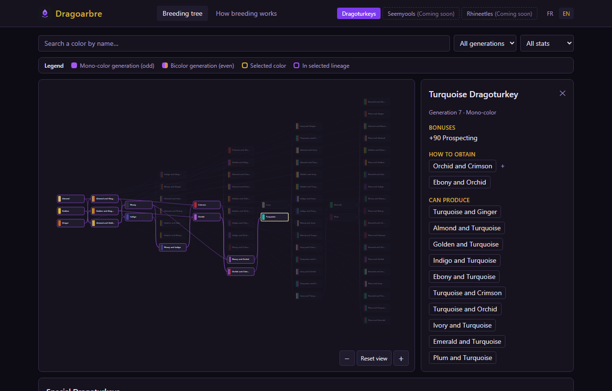
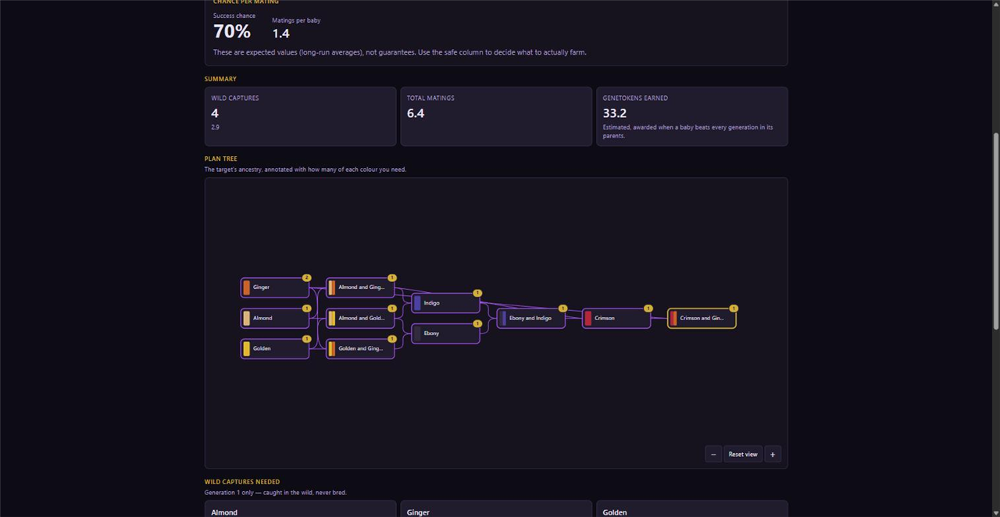

# Dragoarbre

An interactive, bilingual (FR/EN) breeding tree and planner for Dofus
mounts — all three species and every one of their **306 colours** across 10
generations: how to obtain each one, its full lineage back to the wild base
colours, and what reaching it will actually cost you.

Dofus's mount-breeding system is a large, branching family tree that's
easy to get lost in without a reference. Dragoarbre is that reference: a
visual, zoomable map of the whole tree, with a search-and-filter panel and
a detail view for every color — plus a planner that turns any color into a
shopping list of matings and wild captures.

> Fan project. Unofficial. See [Disclaimer](#disclaimer).

## Features

- **Three species** — Dragoturkeys (66 colours), Seemyools (120) and
  Rhineetles (120), each on its own tab. The tab lives in the URL, so a
  shared link opens on the right species.
- **Full breeding tree** — every colour of the selected species,
  generations 1–10, as a pan-and-zoom SVG graph. Click a colour to highlight
  its complete lineage back to generation 1.
- **Multiple recipes per colour** — Seemyools and Rhineetles can have up to
  12 ways to breed the same colour. The tree draws the cheapest by default,
  any node can reveal all of its recipes, and the detail panel always lists
  every one with what it costs in wild captures.
- **Breeding planner** — pick a target color and a quantity, set your
  parent level and boosts (Optimakina, Almanax, cloning), and get the
  success chance per mating plus every mating, mount and wild capture the
  plan needs, broken down by generation. Plans are shareable: the whole
  plan lives in the URL.
- **Detail panel** — name, generation, the species bonus every mount of that
  species carries, stat bonuses, every recipe (or wild-capture info),
  everything a colour can produce, and a "Plan this mount" shortcut into the
  planner.
- **Bilingual search** — matches FR or EN names regardless of the active
  UI language, plus filters by generation and by bonus stat.
- **FR/EN language switcher**, auto-detected from the browser, persisted
  across visits.
- **Special mounts section** for the two non-breedable Dragoturkeys.
- **"How breeding works" page** explaining the underlying game mechanics,
  including the exact target-generation probability formula.
- Dark, fantasy-leaning visual theme — no Ankama assets, no ripped
  sprites.





## Live site

**[radishoux.github.io/dragoarbre](https://radishoux.github.io/dragoarbre/)**

## Quickstart

```bash
bun install
bun run dev       # http://localhost:5173/dragoarbre/
bun test          # data integrity + breeding-math + planner tests
bun run lint       # Biome
bun run build       # production build → dist/
```

## Tech stack

Bun · React + TypeScript (strict) · Vite · react-i18next · react-router
(`HashRouter`) · Tailwind CSS v4 · Biome · `bun test` · GitHub Actions →
GitHub Pages.

## Documentation

| Doc | Covers |
|---|---|
| [docs/OVERVIEW.md](docs/OVERVIEW.md) | The product: the problem it solves, the domain for non-players, how each screen works, the phase roadmap. |
| [docs/ARCHITECTURE.md](docs/ARCHITECTURE.md) | The technical design: folder structure, data model, tree layout algorithm, breeding math, the planner engine, i18n, state, build/deploy — with diagrams. |
| [docs/DECISIONS.md](docs/DECISIONS.md) | Append-only architecture decision log: what was chosen and why. |
| [docs/DATA.md](docs/DATA.md) | Everything about the game data: fields, sourcing rule, how to correct a value, how to add a species. |
| [CONTRIBUTING.md](CONTRIBUTING.md) | Setup, code style, commit conventions, how to propose a data correction. |
| [CLAUDE.md](CLAUDE.md) | Commands, data location, phase roadmap, doc maintenance rules. |

## Deployment

On every push to `main`, `.github/workflows/deploy.yml` runs the tests,
builds the site, and deploys `dist/` to GitHub Pages via the official
`actions/deploy-pages` action — already enabled on this repository. If you
fork this repo, you'll need the same **one-time setup**: in Settings →
Pages, set **Source** to **GitHub Actions**.

## Disclaimer

Dragoarbre is an unofficial fan project. Dofus is a registered trademark
of Ankama. Dragoarbre is not affiliated with, endorsed by, or sponsored by
Ankama. Data reflects the Dofus 3.5 breeding rework.

---

## En français

Dragoarbre est un arbre de reproduction interactif et bilingue (FR/EN)
pour les montures de Dofus : les trois espèces — Dragodindes, Muldos et
Volkornes — soit **306 couleurs** sur 10 générations, comment les obtenir, et
leur lignée complète jusqu'aux couleurs sauvages de base. Le planificateur transforme n'importe quelle
couleur cible en liste de courses : la chance de réussite par
accouplement, le nombre d'accouplements, de montures et de captures
sauvages nécessaires, génération par génération — et chaque plan tient
dans son URL, donc il se partage. C'est un projet de fan non officiel —
Dofus est une marque déposée d'Ankama, sans affiliation avec ce projet.
Les données reflètent la refonte de l'élevage de Dofus 3.5. Voir `bun
install && bun run dev` pour lancer le projet en local ; la documentation
complète est listée ci-dessus (en anglais, l'interface de l'application
reste bilingue).
