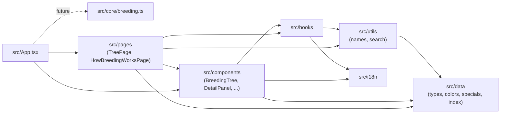
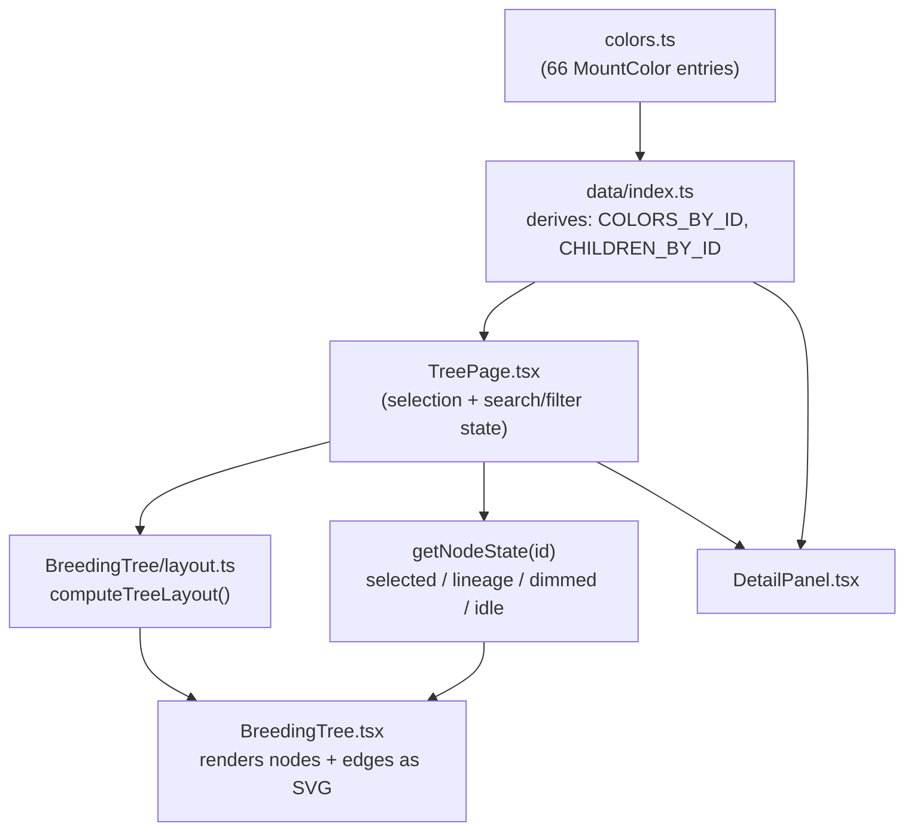

# Architecture

The technical reference: folder structure, data model invariants, how the
tree layout and lineage highlighting work, the breeding math module, i18n,
state management, and the build/deploy pipeline.

## Folder structure

```
dragoarbre/
├── src/
│   ├── data/            # Typed game data + derived indices (see docs/DATA.md)
│   │   ├── types.ts         # MountColor, Bonus, SpecialMount, StatId, SpeciesId
│   │   ├── colors.ts         # The 66 Dragoturkey colors (raw data)
│   │   ├── specials.ts       # 2 special Dragoturkeys (raw data)
│   │   ├── wildCapture.ts    # Bilingual wild-capture info
│   │   ├── colors.test.ts    # Data integrity tests
│   │   └── index.ts          # Public API: re-exports + derived reverse index / lineage
│   ├── core/
│   │   ├── breeding.ts        # Pure breeding-probability math (documented constants + functions)
│   │   └── breeding.test.ts
│   ├── i18n/
│   │   ├── index.ts           # i18next init (FR/EN, browser detection, localStorage persistence)
│   │   └── locales/{fr,en}/translation.json
│   ├── components/
│   │   ├── BreedingTree/      # Tree SVG: layout.ts, palette.ts, TreeNode.tsx, usePanZoom.ts, BreedingTree.tsx
│   │   ├── DetailPanel.tsx
│   │   ├── SearchFilters.tsx
│   │   ├── Legend.tsx
│   │   ├── SpecialMounts.tsx
│   │   ├── Header.tsx         # Nav, species tabs, language switcher
│   │   └── Footer.tsx         # Ankama disclaimer
│   ├── pages/
│   │   ├── TreePage.tsx           # "/" — composes the tree + panel + search/filters + specials
│   │   └── HowBreedingWorksPage.tsx  # "/how-breeding-works"
│   ├── hooks/
│   │   ├── useDocumentTitle.ts
│   │   └── useLocalizedName.ts
│   ├── utils/
│   │   ├── names.ts           # Full display name composition (species word + FR/EN order)
│   │   └── search.ts          # Bilingual name matching
│   ├── App.tsx                 # HashRouter + Header/Footer shell + routes
│   ├── main.tsx                 # Entry point
│   └── index.css                # Tailwind import + dark-fantasy theme tokens
├── docs/                 # This documentation set
├── .github/workflows/deploy.yml
├── BRIEF-phase-1.md       # Source brief for all phase 1 game data
└── CLAUDE.md              # Commands, data location, roadmap, maintenance rules
```

## Module dependency diagram



`core/breeding.ts` has no consumers yet in phase 1 UI (only its tests) —
it's built and verified now so phase 2's planner can import it directly.

## Data model and invariants

See `docs/DATA.md` for the full field reference. The invariants enforced by
`src/data/colors.test.ts` (and checked structurally, not just spot-checked):

- Exactly 66 colors total, with the exact per-generation counts
  3/3/2/7/2/11/2/15/2/19 for generations 1-10.
- All ids unique.
- Every `cross` tuple references ids that exist and are of strictly lower
  generation than the color itself (guarantees the DAG has no cycles and
  every color ultimately traces to generation 1).
- Generation-1 colors have `wildCapture: true` and no `cross`; every other
  color has a `cross` of exactly two parent ids and no `wildCapture`.
- `kind` matches generation parity (`mono` for odd, `bicolor` for even).

The reverse "children of" index and lineage walks in `src/data/index.ts`
are derived, not stored — see that file's docstrings for the exact
algorithms (a `Map` built once from `cross`, and an iterative stack-based
walk for ancestry).

## Data flow: data files → rendered tree



`getNodeState` combines two independent concerns into one visual state per
node: (1) whether the node matches the active search/generation/stat
filters, and (2) whether a node is selected and, if so, whether the
current node is inside `getLineageIds(selectedId)`. A node dims if it
fails either check; it's never removed from the DOM, so the tree's layout
never shifts as filters or selection change.

## Tree layout and lineage highlighting

`computeTreeLayout()` (`src/components/BreedingTree/layout.ts`) is a pure
function: given the color list, it buckets colors by `generation`, lays
out one fixed-width column per generation, and stacks each generation's
nodes vertically, centered against the tallest column. It returns a
`Map<colorId, {x, y}>` plus overall SVG dimensions — no React, no
side effects, fully unit-testable (currently exercised indirectly through
the data tests; a dedicated layout test can be added if the layout logic
grows more complex).

Lineage highlighting reuses `getAncestorIds()`/`getLineageIds()` from the
data layer — the tree component itself does no graph traversal; it only
asks "is this id in the lineage set" per node.

Pan/zoom (`usePanZoom.ts`) is a small hook wrapping an SVG `<g
transform="translate(...) scale(...)">`: pointer-event drag for panning
(unifies mouse and single-finger touch), wheel for zoom, and a manual
two-finger touch handler for pinch-zoom, plus explicit +/-/reset buttons
for precision and non-touch accessibility.

## Breeding math module

`src/core/breeding.ts` exports `BREEDING_CONSTANTS` (base chance,
per-level bonus, Optimakina/Almanax bonuses, gauge max, mounts-per-couple)
and two pure functions:

- `targetGenerationChance(input)` — the documented formula, capped at 100%,
  with a rounding step to avoid floating-point drift (e.g.
  `0.9999999999999999` instead of `1`) before capping.
- `expectedMatingsForTargetGeneration(chance)` — `1 / chance`.

Both are unit-tested against the brief's own worked example (two level-200
parents → 90%, 100% with an Optimakina). See `docs/DECISIONS.md` for why
only this formula — not the residual color distribution — is modeled as
exact math.

## i18n setup

`src/i18n/index.ts` configures `i18next` + `react-i18next` +
`i18next-browser-languagedetector`: language is auto-detected from the
browser on first visit, then persisted to `localStorage`
(`dragoarbre-language`) and read from there on subsequent visits. All
user-facing strings live in `src/i18n/locales/{fr,en}/translation.json` —
components call `t('some.key')`, never hardcode text. Game data (color
names, stat names) is bilingual at the data layer instead (`{ fr, en }`
fields on `MountColor`/`Bonus`), since that's content, not UI chrome; see
`docs/DATA.md`.

## State management

No global state library. Phase 1's only meaningfully shared state — the
selected color id, the active search/filter values — lives in
`TreePage.tsx`'s local `useState`, passed down as props. i18next holds its
own language state internally (read via `useTranslation()`). This is
intentionally minimal: there's exactly one screen with interactive state,
and prop-drilling two levels deep doesn't yet justify context or a store.
Revisit if phase 2's planner needs state shared across more of the tree
(e.g. a persisted shopping-list selection).

## Build and GitHub Pages deployment

`vite.config.ts` sets `base: '/dragoarbre/'` so built asset URLs resolve
correctly under `https://<owner>.github.io/dragoarbre/`.
`.github/workflows/deploy.yml` runs on every push to `main`: Bun setup via
`oven-sh/setup-bun`, `bun install --frozen-lockfile`, `bun test`, `bun run
build`, then `actions/configure-pages` + `actions/upload-pages-artifact` +
`actions/deploy-pages` publish `dist/`. The repository owner must set
**Settings → Pages → Source → GitHub Actions** once; the workflow does not
(and cannot) do this for you.

## Running locally

```bash
bun install
bun run dev      # http://localhost:5173/dragoarbre/
bun test         # data + breeding-math integrity tests
bun run lint      # Biome check
bun run build     # tsc -b && vite build → dist/
bun run preview   # serve the production build locally
```
