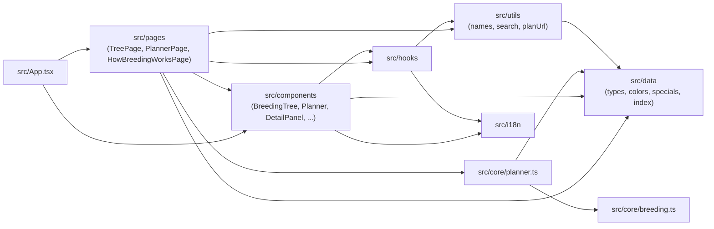
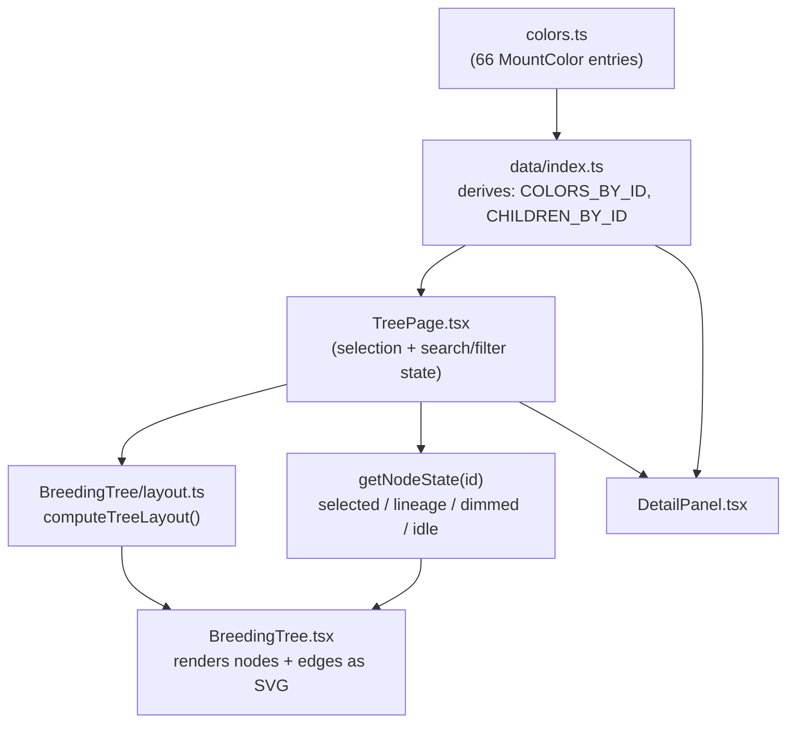
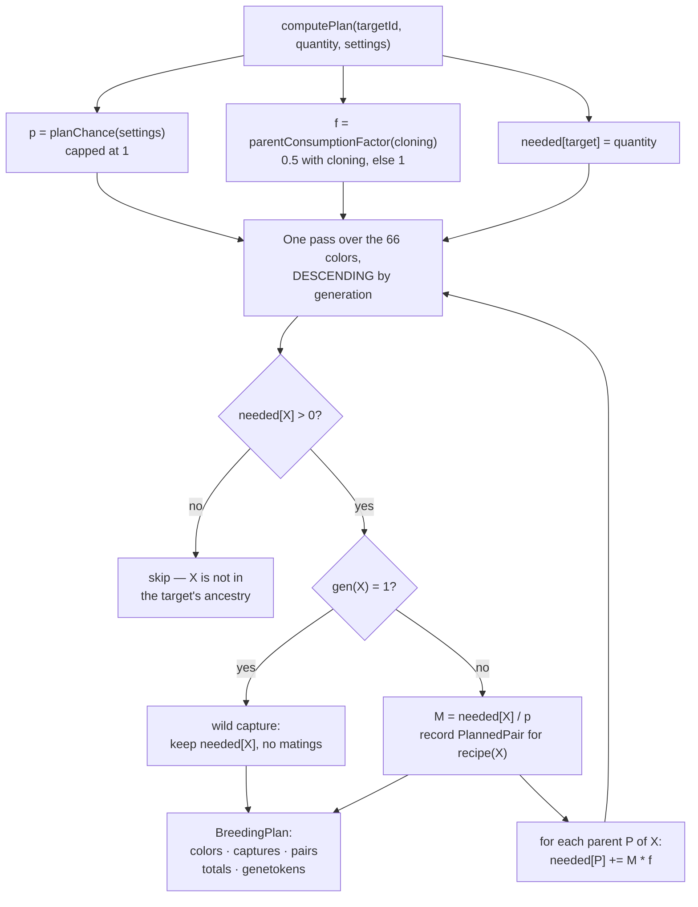

# Architecture

The technical reference: folder structure, data model invariants, how the
tree layout and lineage highlighting work, the breeding math module, the
planner engine, i18n, state management, and the build/deploy pipeline.

## Folder structure

```
dragoarbre/
├── src/
│   ├── data/            # Typed game data + derived indices (see docs/DATA.md)
│   │   ├── types.ts         # MountColor, Bonus, SpecialMount, StatId, SpeciesId
│   │   ├── colors.ts         # The 66 Dragoturkey colors (raw data)
│   │   ├── specials.ts       # 2 special Dragoturkeys (raw data)
│   │   ├── wildCapture.ts    # Bilingual wild-capture info
│   │   ├── colors.test.ts    # Data integrity tests
│   │   └── index.ts          # Public API: re-exports + derived reverse index / lineage
│   ├── core/
│   │   ├── breeding.ts        # Pure breeding-probability math (documented constants + functions)
│   │   ├── breeding.test.ts
│   │   ├── planner.ts         # Pure shopping-list planner: matings, mounts and captures per color
│   │   └── planner.test.ts
│   ├── i18n/
│   │   ├── index.ts           # i18next init (FR/EN, browser detection, localStorage persistence)
│   │   └── locales/{fr,en}/translation.json
│   ├── components/
│   │   ├── BreedingTree/      # Tree SVG: layout.ts, palette.ts, TreeNode.tsx, usePanZoom.ts, BreedingTree.tsx
│   │   ├── Planner/           # Planner UI: PlannerControls, PlanSummary, PlanBreakdown, PlanCaptures, PlanTree, PlanAssumptions, usePlanFormat.ts
│   │   ├── DetailPanel.tsx
│   │   ├── SearchFilters.tsx
│   │   ├── Legend.tsx
│   │   ├── SpecialMounts.tsx
│   │   ├── Header.tsx         # Nav, species tabs, language switcher
│   │   └── Footer.tsx         # Ankama disclaimer
│   ├── pages/
│   │   ├── TreePage.tsx           # "/" — composes the tree + panel + search/filters + specials
│   │   ├── PlannerPage.tsx        # "/planner" — target + assumptions → plan; state read from the URL
│   │   └── HowBreedingWorksPage.tsx  # "/how-breeding-works"
│   ├── hooks/
│   │   ├── useDocumentTitle.ts
│   │   └── useLocalizedName.ts
│   ├── utils/
│   │   ├── names.ts           # Full display name composition (species word + FR/EN order)
│   │   ├── planUrl.ts         # Encode/decode planner state to and from the route's query string
│   │   ├── planUrl.test.ts
│   │   └── search.ts          # Bilingual name matching
│   ├── App.tsx                 # HashRouter + Header/Footer shell + routes
│   ├── main.tsx                 # Entry point
│   └── index.css                # Tailwind import + dark-fantasy theme tokens
├── docs/                 # This documentation set
├── .github/workflows/deploy.yml
├── BRIEF-phase-1.md       # Source brief for all phase 1 game data
└── CLAUDE.md              # Commands, data location, roadmap, maintenance rules
```

## Module dependency diagram



Phase 2 connected the edge phase 1 had drawn as a dotted "future": the
planner is `breeding.ts`'s first real consumer, and `PlannerPage` is the
planner's. `src/core` stays React-free in both directions — it imports
game data and nothing else, and nothing in `core` knows that a UI exists.

## Data model and invariants

See `docs/DATA.md` for the full field reference. The invariants enforced by
`src/data/colors.test.ts` (and checked structurally, not just spot-checked):

- Exactly 66 colors total, with the exact per-generation counts
  3/3/2/7/2/11/2/15/2/19 for generations 1-10.
- All ids unique.
- Every `cross` tuple references ids that exist and are of strictly lower
  generation than the color itself (guarantees the DAG has no cycles and
  every color ultimately traces to generation 1).
- Generation-1 colors have `wildCapture: true` and no `cross`; every other
  color has a `cross` of exactly two parent ids and no `wildCapture`.
- `kind` matches generation parity (`mono` for odd, `bicolor` for even).

The reverse "children of" index and lineage walks in `src/data/index.ts`
are derived, not stored — see that file's docstrings for the exact
algorithms (a `Map` built once from `cross`, and an iterative stack-based
walk for ancestry).

## Data flow: data files → rendered tree



`getNodeState` combines two independent concerns into one visual state per
node: (1) whether the node matches the active search/generation/stat
filters, and (2) whether a node is selected and, if so, whether the
current node is inside `getLineageIds(selectedId)`. A node dims if it
fails either check; it's never removed from the DOM, so the tree's layout
never shifts as filters or selection change.

## Tree layout and lineage highlighting

`computeTreeLayout()` (`src/components/BreedingTree/layout.ts`) is a pure
function: given the color list, it buckets colors by `generation`, lays
out one fixed-width column per generation, and stacks each generation's
nodes vertically, centered against the tallest column. It returns a
`Map<colorId, {x, y}>` plus overall SVG dimensions — no React, no
side effects, fully unit-testable (currently exercised indirectly through
the data tests; a dedicated layout test can be added if the layout logic
grows more complex).

Lineage highlighting reuses `getAncestorIds()`/`getLineageIds()` from the
data layer — the tree component itself does no graph traversal; it only
asks "is this id in the lineage set" per node.

Pan/zoom (`usePanZoom.ts`) is a small hook wrapping an SVG `<g
transform="translate(...) scale(...)">`: pointer-event drag for panning
(unifies mouse and single-finger touch), wheel for zoom, and a manual
two-finger touch handler for pinch-zoom, plus explicit +/-/reset buttons
for precision and non-touch accessibility.

## Breeding math module

`src/core/breeding.ts` exports `BREEDING_CONSTANTS` (base chance,
per-level bonus, Optimakina/Almanax bonuses, gauge max, mounts-per-couple)
and two pure functions:

- `targetGenerationChance(input)` — the documented formula, capped at 100%,
  with a rounding step to avoid floating-point drift (e.g.
  `0.9999999999999999` instead of `1`) before capping.
- `expectedMatingsForTargetGeneration(chance)` — `1 / chance`.

Both are unit-tested against the brief's own worked example (two level-200
parents → 90%, 100% with an Optimakina). See `docs/DECISIONS.md` for why
only this formula — not the residual color distribution — is modeled as
exact math.

## Planner module

`src/core/planner.ts` is the phase 2 engine: given a target color, a
quantity and a set of plan-wide assumptions, it returns how many matings
of which recipe pairs, how many mounts of each intermediate color, and how
many generation-1 wild captures the plan needs. Like `breeding.ts` it is
pure — no React, no side effects, no mutation of the game data — so the
whole feature is testable without rendering anything.

### Settings and the two levers

A `PlannerSettings` object (`parentLevel`, `optimakina`, `almanaxTakeza`,
`cloning`) applies identically to every mating in a plan. One level is
used for both parents of every pair: per-pair levels would multiply the
input surface without changing the shape of the answer, since players
level a whole breeding line together.

`planChance(settings)` is the per-mating success probability, delegating
to `targetGenerationChance()` with the same level on both sides:

```text
p = min(1, 0.30 + 0.0015 * (levelA + levelB) + (optimakina ? 0.10 : 0) + (takeza ? 0.20 : 0))
```

Expected matings for `q` children is then `M = q / p`.

`parentConsumptionFactor(cloning)` is the second lever, `f`. A mating
spends two fertile parents — one of each recipe color — and leaves them
sterile. Cloning merges the two spent parents back into one fertile mount
that is randomly one of the two colors, returning on average 0.5 of each,
so each mating nets **0.5** consumed per parent color instead of 1.
`f = cloning ? 0.5 : 1`.

### The recursion

The brief specifies the plan as a recursion over the color DAG:

```text
plan(X, q):
  if gen(X) === 1: captures[X] += q
  else:
    M = q / p                    // expected matings for q successes
    matings[recipe(X)] += M
    f = cloning ? 0.5 : 1
    for each parent P of X: plan(P, M * f)
```

Generation-1 colors terminate the recursion: they are caught in the wild,
never bred, so they cost captures and zero matings.

### Evaluated as a descending sweep, not literal recursion

`computePlan()` does not recurse. It seeds a `needed` map with
`{ target: quantity }` and then sweeps the color list **once, in
descending generation order**, accumulating parent requirements into the
same map as it goes.

This is exactly equivalent to the recursion, and the reason is a data
invariant, not a coincidence: every `cross` edge points to a strictly
lower generation, enforced structurally by `src/data/colors.test.ts`. So
a descending pass reaches a color only after every color that could
possibly consume it has already been visited and has already added its
share to `needed`. Each color's total requirement is therefore final by
the time the sweep gets to it.

The payoff is complexity. The literal recursion re-walks the same
sub-trees once per distinct ancestry path, which is exponential in the
number of paths — the deep generations of the Dragoturkey DAG have a lot
of them. The sweep is linear in the number of colors (66), with one
`Map` lookup per edge.



### The `BreedingPlan` shape

`computePlan()` returns `null` for an unknown target id; otherwise a
`BreedingPlan` carrying, alongside the echoed `targetId` / `quantity` /
`settings`:

- `chance` (`p`), `expectedMatingsPerSuccess` (`1 / p`), and `guaranteed`
  — true when `p` is 1, which is what lets the UI promise exact counts
  instead of averages.
- `colors: PlannedColor[]` — every color the plan touches, ascending by
  generation. Each carries `expected` (a real number), `safe`
  (`Math.ceil(expected)` — what to actually farm), `matings`, and a
  `wildCapture` flag.
- `captures: PlannedColor[]` — the generation-1 subset of the above.
- `pairs: PlannedPair[]` — every recipe to mate, with `matings` and
  expected `successes`, ascending by the child's generation.
- `totalMatings`, `totalCaptures`, `totalCapturesSafe`, and `genetokens`.

A private `tidy()` helper rounds to 9 decimal places before every count is
stored, so float drift (`0.30000000000000004`) never reaches a display
string or a `Math.ceil`.

### Genetokens

A mating awards genetokens when the baby's generation exceeds every
generation present in both parents' family trees — which is true of every
successful mating in a clean plan, since the plan only ever crosses a
color's exact recipe. The award is the sum of the two parents'
generation values from `GENETOKEN_VALUE_BY_GENERATION`
(`{1:1, 2:2, 3:4, 4:8, 5:15, 6:30, 7:60, 8:120, 9:250}`; generation 10
never appears because a generation-10 color is never a parent). The plan's
estimate is the sum over recipe pairs of `successes × (value(genA) +
value(genB))`.

### Planner UI and URL state

`/planner` is a new route reachable from the header nav, and the phase 1
detail panel gained a **"Plan this mount"** button that opens the planner
already targeting that color. The page takes a target color (searchable,
bilingual, same matching as the tree's search), a quantity, a parent-level
slider over `PARENT_LEVEL_MIN`..`PARENT_LEVEL_MAX` (1..200), and the three
assumption toggles. It renders `p` as a percentage with a **Guaranteed**
badge when it reaches 100%, the expected matings per attempt, summary
cards, a per-generation breakdown table (color, expected count, safe
count, matings), and a collapsible note spelling out the four modelling
assumptions.

Plan state lives in the query string of the hash route, decoded and
encoded by `src/utils/planUrl.ts`:

```text
#/planner?target=<colorId>&qty=<1-999>&level=<1-200>&opti=<0|1>&takeza=<0|1>&clone=<0|1>
```

Every parameter is optional. Missing toggles and level fall back to
`DEFAULT_PLANNER_SETTINGS` (level 100, Optimakina on, Takeza off, cloning
on), a missing quantity to 1, and a missing or unknown `target` to no
selection — so a bare `#/planner` is valid and a partial or stale link
still resolves to a usable screen. `decodePlanUrl()` treats the query
string as untrusted user input: unparseable numbers fall back, in-range
ones are clamped, and anything other than `0`/`1` leaves a flag at its
default. The parameter names in `PLAN_URL_PARAMS` are a frozen contract —
links people have shared are written against those exact strings.

The point of all this is shareability: a plan is a URL you can bookmark,
paste to a guildmate, or reload without losing.

The plan tree reuses the phase 1 renderer rather than drawing a second
graph — the same layout and node components, restricted to the target's
ancestry (the lineage set `src/data/index.ts` already derives), with each
node badged with how many of that color the plan needs. Phase 1's decision
to keep `computeTreeLayout()` a pure function over an arbitrary color list
is what makes this a restriction rather than a rewrite.

## i18n setup

`src/i18n/index.ts` configures `i18next` + `react-i18next` +
`i18next-browser-languagedetector`: language is auto-detected from the
browser on first visit, then persisted to `localStorage`
(`dragoarbre-language`) and read from there on subsequent visits. All
user-facing strings live in `src/i18n/locales/{fr,en}/translation.json` —
components call `t('some.key')`, never hardcode text. Game data (color
names, stat names) is bilingual at the data layer instead (`{ fr, en }`
fields on `MountColor`/`Bonus`), since that's content, not UI chrome; see
`docs/DATA.md`.

## State management

No global state library. Phase 1's only meaningfully shared state — the
selected color id, the active search/filter values — lives in
`TreePage.tsx`'s local `useState`, passed down as props. i18next holds its
own language state internally (read via `useTranslation()`). This is
intentionally minimal: there's exactly one screen with interactive state,
and prop-drilling two levels deep doesn't yet justify context or a store.

Phase 1 left this open with "revisit if phase 2's planner needs state
shared across more of the tree". It didn't — and the reason is worth
recording, because the answer went the opposite way from a store. The
planner's entire state is its target, quantity and four assumptions, and
all of it lives in the **URL query string** (`src/utils/planUrl.ts`),
read back through the router. `computePlan()` is pure and cheap enough to
call on every render, so there is nothing to cache and nothing to keep in
sync: the URL is the single source of truth, React holds no copy of it,
and the feature gains shareable, bookmarkable, back-button-correct plans
for free. Still no store, and now for a better reason than "the app is
small".

## Build and GitHub Pages deployment

`vite.config.ts` sets `base: '/dragoarbre/'` so built asset URLs resolve
correctly under `https://<owner>.github.io/dragoarbre/`.
`.github/workflows/deploy.yml` runs on every push to `main`: Bun setup via
`oven-sh/setup-bun`, `bun install --frozen-lockfile`, `bun test`, `bun run
build`, then `actions/configure-pages` + `actions/upload-pages-artifact` +
`actions/deploy-pages` publish `dist/`. The repository owner must set
**Settings → Pages → Source → GitHub Actions** once; the workflow does not
(and cannot) do this for you.

## Running locally

```bash
bun install
bun run dev      # http://localhost:5173/dragoarbre/
bun test         # data, breeding-math and planner tests
bun run lint      # Biome check
bun run build     # tsc -b && vite build → dist/
bun run preview   # serve the production build locally
```
