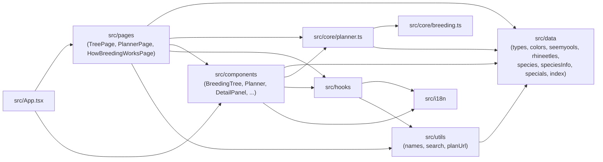
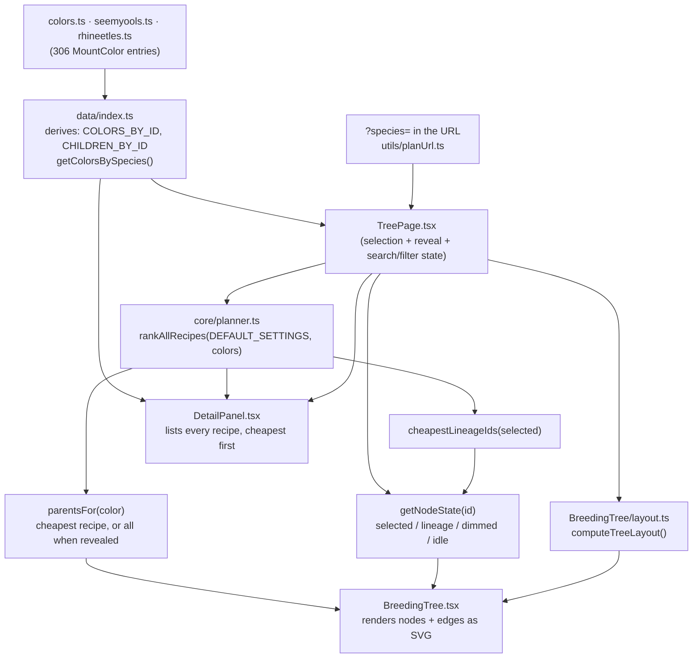
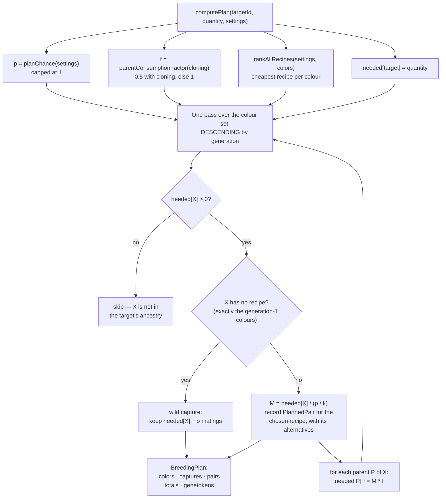

# Architecture

The technical reference: folder structure, data model invariants, how the
tree layout and lineage highlighting work, the breeding math module, the
planner engine, i18n, state management, and the build/deploy pipeline.

## Folder structure

```
dragoarbre/
├── src/
│   ├── data/            # Typed game data + derived indices (see docs/DATA.md)
│   │   ├── types.ts         # MountColor, Bonus, SpecialMount, StatId, SpeciesId
│   │   ├── colors.ts         # The 66 Dragoturkey colors (raw data, fully enumerated)
│   │   ├── seemyools.ts      # 15 Seemyool monocolors; 105 bicolors derived
│   │   ├── rhineetles.ts     # 15 Rhineetle monocolors; 105 bicolors derived
│   │   ├── species.ts        # buildSpecies() derivation + colorId() rule (not data)
│   │   ├── speciesInfo.ts    # Per-species word, common bonus, wild-capture text
│   │   ├── specials.ts       # 2 special Dragoturkeys (raw data)
│   │   ├── *.test.ts         # Data integrity tests, one per dataset
│   │   └── index.ts          # Public API: re-exports + derived reverse index / lineage
│   ├── core/
│   │   ├── breeding.ts        # Pure breeding-probability math (documented constants + functions)
│   │   ├── breeding.test.ts
│   │   ├── planner.ts         # Pure planner: recipe ranking, split rule, matings/mounts/captures
│   │   └── planner.test.ts
│   ├── i18n/
│   │   ├── index.ts           # i18next init (FR/EN, browser detection, localStorage persistence)
│   │   └── locales/{fr,en}/translation.json
│   ├── components/
│   │   ├── BreedingTree/      # Tree SVG: layout.ts, palette.ts, TreeNode.tsx, usePanZoom.ts, BreedingTree.tsx
│   │   ├── Planner/           # Planner UI: PlannerControls, PlanSummary, PlanBreakdown, PlanCaptures, PlanTree, PlanAssumptions, usePlanFormat.ts
│   │   ├── DetailPanel.tsx
│   │   ├── SearchFilters.tsx
│   │   ├── Legend.tsx
│   │   ├── SpecialMounts.tsx
│   │   ├── Header.tsx         # Nav, species tabs, language switcher
│   │   └── Footer.tsx         # Ankama disclaimer
│   ├── pages/
│   │   ├── TreePage.tsx           # "/" — composes the tree + panel + search/filters + specials
│   │   ├── PlannerPage.tsx        # "/planner" — target + assumptions → plan; state read from the URL
│   │   └── HowBreedingWorksPage.tsx  # "/how-breeding-works"
│   ├── hooks/
│   │   ├── useDocumentTitle.ts
│   │   └── useLocalizedName.ts
│   ├── utils/
│   │   ├── names.ts           # Full display name composition (species word + FR/EN order)
│   │   ├── planUrl.ts         # Encode/decode planner state to and from the route's query string
│   │   ├── planUrl.test.ts
│   │   └── search.ts          # Bilingual name matching
│   ├── App.tsx                 # HashRouter + Header/Footer shell + routes
│   ├── main.tsx                 # Entry point
│   └── index.css                # Tailwind import + dark-fantasy theme tokens
├── docs/                 # This documentation set
├── .github/workflows/deploy.yml
├── BRIEF-phase-1.md       # Source brief for phase 1 game data (Dragoturkeys)
├── BRIEF-phase-3.md       # Source brief for phase 3 game data (Seemyools, Rhineetles)
├── ORCHESTRATION.md       # Multi-agent protocol used to run phase 3
├── TASKS.md               # Phase task board
└── CLAUDE.md              # Commands, data location, roadmap, maintenance rules
```

## Module dependency diagram



Phase 2 connected the edge phase 1 had drawn as a dotted "future": the
planner is `breeding.ts`'s first real consumer, and `PlannerPage` is the
planner's. Phase 3 added `components --> planner`: once a colour can have
several recipes, the tree has to ask the planner which one is cheapest before
it can draw an edge, and the detail panel lists the ranking. `src/core` stays
React-free in both directions — it imports game data and nothing else, and
nothing in `core` knows that a UI exists.

## Data model and invariants

See `docs/DATA.md` for the full field reference. **306 colours across three
species**: 66 Dragoturkeys, 120 Seemyools, 120 Rhineetles. The invariants are
enforced by `src/data/colors.test.ts`, `seemyools.test.ts`,
`rhineetles.test.ts` and `species.test.ts`, checked structurally rather than
spot-checked:

- Exact per-generation counts. Dragoturkeys 3/3/2/7/2/11/2/15/2/19 for
  generations 1-10; each new species 15 monocolors plus the 105 bicolors
  derived from them.
- All ids unique across all three species — which is why the two new species
  prefix theirs (all three have an "Amande").
- Every recipe in `crosses` references ids that exist and are of strictly
  lower generation than the colour itself. This guarantees the DAG is acyclic
  and every colour traces back to generation 1, and it is what licenses both
  the planner's descending sweep and the ranking's ascending one.
- Generation-1 colours have `wildCapture: true` and no `crosses`; every other
  colour has at least one recipe of exactly two parent ids and no
  `wildCapture`. A Dragoturkey always has exactly one recipe; a Seemyool or
  Rhineetle monocolor can have up to 12.
- `kind` matches generation parity (`mono` for odd, `bicolor` for even).
- Exact recipe counts per odd-generation monocolor: Seemyool
  6/3/8/8/4/8/5/5/5/5, Rhineetle 3/3/3/3/12/12/8/2/2/2/2.

The reverse "children of" index and lineage walks in `src/data/index.ts`
are derived, not stored — see that file's docstrings for the exact
algorithms (a `Map` built once from `crosses`, and an iterative stack-based
walk for ancestry).

## Data flow: data files → rendered tree



The tree is scoped to one species by the `?species=` query parameter, the same
one the planner uses, so the header tabs, a pasted link and the rendered tree
cannot disagree. `rankAllRecipes()` is called once per species at the planner's
default settings: the tree has no assumption controls of its own, so it shows
the recipe a default plan would breed.

`getNodeState` combines two independent concerns into one visual state per
node: (1) whether the node matches the active search/generation/stat
filters, and (2) whether a node is selected and, if so, whether the
current node is inside `cheapestLineageIds(selectedId, rankings)`. A node
dims if it fails either check; it's never removed from the DOM, so the tree's layout
never shifts as filters or selection change.

## Tree layout and lineage highlighting

`computeTreeLayout()` (`src/components/BreedingTree/layout.ts`) is a pure
function: given the colour list, it buckets colours by `generation`, lays out
one **row** per generation running down the page from generation 1, and spreads
each generation's colours left to right, centred. It returns a
`Map<colorId, {x, y}>` plus overall SVG dimensions — no React, no side effects,
fully unit-testable (currently exercised indirectly through the data tests).

The tree runs down rather than across because that is how it is read and
scrolled: generation 1 is where a plan starts, and the wheel walks you forward
through the generations.

**Generations wider than the row cap wrap onto sub-rows**, and the cap is
responsive: `computeTreeLayout(colors, maxPerRow)` takes it as a parameter and
`BreedingTree` derives it from the container's measured width, so the tree fits
its pane at a legible zoom on any screen — about 2 columns on a 375px phone, 5
in a 786px desktop pane. The default of `MAX_PER_ROW` (12) applies when no cap
is given.

Measuring that width needs three triggers, because none is reliable alone: an
immediate read (which races the flex layout and can see 0), a
`requestAnimationFrame` (which catches the settled box), and a `ResizeObserver`
(which catches later changes, such as the detail panel appearing beside the
tree). The measure function is idempotent, so running it repeatedly costs
nothing — and a one-shot read alone pinned the desktop tree to one colour per
row until the extra triggers were added. Turning the
tree without this made the two new species 8660px wide — their widest
generation holds 50 colours — which is about eleven screens on the one axis the
wheel does not scroll. Wrapping puts Seemyool at 2144 × 1630 instead: a column
you scroll, which is the whole point of the orientation.

Wrapping is also why the y cursor accumulates per generation instead of being
`(generation - 1) * ROW_HEIGHT`: a wrapped generation is several sub-rows tall
and has to push everything below it down. A useful side effect is that a sparse
set — the planner lays out only a target's ancestry, which can skip generations
— now closes up instead of leaving a band of empty canvas.

Lineage highlighting asks `cheapestLineageIds()` from `src/core/planner.ts`,
not the data layer's `getLineageIds()` — the tree component itself still does
no graph traversal, it only asks "is this id in the lineage set" per node.
The distinction matters once a colour has several recipes: the data-layer walk
follows *every* recipe, which for a Rhineetle Plum reaches 28 colours, where
the plan actually breeds 11. Highlighting the union would light up ancestors
along paths nothing takes, and disagree with the edges drawn right next to
them. `BRIEF-phase-3.md` section 9 asks for highlighting to follow the
cheapest-recipe path, and this is that path.

Edges follow the same rule. `BreedingTree` takes an optional
`parentsFor(color)` prop; omitted, it draws every parent across every recipe
(the phase 1 behaviour, and correct when each colour has one). `TreePage`
passes the cheapest recipe's two parents instead, which takes the Rhineetle
tree from 280 edges to 232, and passes all of them for the one node whose
reveal toggle is on. `PlanTree` passes the pairs the plan actually mates.

Pan/zoom (`usePanZoom.ts`) is a small hook wrapping an SVG `<g
transform="translate(...) scale(...)">`: pointer-event drag for panning
(unifies mouse and single-finger touch), **wheel for panning**, Ctrl/Shift with
the wheel for zoom, a manual two-finger handler for pinch-zoom, plus explicit
+/−/reset buttons for precision and non-touch accessibility.

The wheel scrolls rather than zooms. Zoom-on-wheel is the surprising binding on
a page you also scroll, and once the tree runs top to bottom the wheel doing
what it does everywhere else is what makes it navigable. Zoom moved to Ctrl or
Shift, the convention browsers and map UIs already use.

**Wheel and touchmove are registered by hand, not as React props**, because
React registers both as *passive* listeners — where the `preventDefault()` that
stops the page scrolling behind the tree is ignored and logs a console error.
`BreedingTree` attaches them via `addEventListener(..., { passive: false })`.
This was a live bug before the wheel binding changed: zoom still worked, so
nothing looked broken, but the page scrolled underneath every gesture.

**Zoom is anchored.** `translate(x, y) scale(s)` scales about the transform
origin, so changing `s` alone slides every point toward it and the tree drifts
sideways as you zoom out. Each zoom moves `x`/`y` by the scale ratio instead,
holding one point still: the cursor for a wheel zoom, the pinch midpoint for a
pinch, the viewport centre for the buttons.

The same rewrite removed two latent faults. `onPointerMove` dereferenced the
drag origin *inside* a `setState` updater, which runs after the handler
returns — if a `pointerup` cleared the ref first, the updater threw and took
the whole page down mid-drag. The origin is now read into a local first. And
`onPointerDown`/`onTouchStart` used a `setState` updater as a getter for the
current state, which is impure and runs twice in development; they read a ref
that mirrors state instead.

The opening view fits the **width** and anchors at the top rather than fitting
both axes. When the width nearly fits, fitting wins over the readability floor
— flooring unconditionally pushed a mobile tree 19px past its own container, so
it opened needing a horizontal pan to see two columns. Fitting both put the full tree at about 22% zoom, where a 12px label
is unreadable; the view now opens like a document, generation 1 at the top, with
a floor of 0.85 so labels stay legible and the rest of the tree is a scroll
away.

## Breeding math module

`src/core/breeding.ts` exports `BREEDING_CONSTANTS` (base chance,
per-level bonus, Optimakina/Almanax bonuses, gauge max, mounts-per-couple)
and two pure functions:

- `targetGenerationChance(input)` — the documented formula, capped at 100%,
  with a rounding step to avoid floating-point drift (e.g.
  `0.9999999999999999` instead of `1`) before capping.
- `expectedMatingsForTargetGeneration(chance)` — `1 / chance`.

Both are unit-tested against the brief's own worked example (two level-200
parents → 90%, 100% with an Optimakina). See `docs/DECISIONS.md` for why
only this formula — not the residual color distribution — is modeled as
exact math.

## Planner module

`src/core/planner.ts` is the phase 2 engine: given a target color, a
quantity and a set of plan-wide assumptions, it returns how many matings
of which recipe pairs, how many mounts of each intermediate color, and how
many generation-1 wild captures the plan needs. Like `breeding.ts` it is
pure — no React, no side effects, no mutation of the game data — so the
whole feature is testable without rendering anything.

### Settings and the two levers

A `PlannerSettings` object (`parentLevel`, `optimakina`, `almanaxTakeza`,
`cloning`, `reproducteur`, `captureNet`) applies identically to every mating in
a plan. One level is
used for both parents of every pair: per-pair levels would multiply the
input surface without changing the shape of the answer, since players
level a whole breeding line together.

`planChance(settings)` is the per-mating success probability, delegating
to `targetGenerationChance()` with the same level on both sides:

```text
p = min(1, 0.30 + 0.0015 * (levelA + levelB) + (optimakina ? 0.10 : 0) + (takeza ? 0.20 : 0))
```

Expected matings for `q` children is then `M = q / p`.

### Reproducteur and the capture net

Two later levers, both off by default so no existing plan or link changed when
they landed.

`birthsPerMating(reproducteur)` is how many babies one mating yields: 2 with
the Reproducteur capacity on either parent, 1 without. A mating still spends
the same two parents, so the capacity does not change `f` — it doubles the
*successes*. That makes the quantity the planner divides by no longer a
probability, which is why `RecipeChoice.successesPerMating` is named what it is
rather than `chance`: at `p = 0.7` with the capacity it is 1.4, and calling
that a chance would be a lie.

Each baby is modelled as an **independent** roll at `p`. That is an assumption,
not a sourced fact — the sources say the capacity grants an extra baby, not how
its colour is decided — so it is listed in the UI's assumptions disclosure
alongside the other four.

`captureNet` is the one setting that changes no count at all. A multiplier net
duplicates whatever it catches, so the plan needs the same *mounts* and fewer
*trips*: `BreedingPlan.captureFights` divides each colour's safe count by the
net's yield and rounds up, per colour, because you catch one colour at a time.
Deliberately a reporting concern and not part of the cost model — a uniform
divisor on every leaf would not move the ranking anyway, and pretending
otherwise would put a display choice inside the maths. The two *reinforced*
nets are not offered: they take every wild mount in a radius-3 zone, so their
yield depends on how many happen to be standing there, and inventing an
occupancy figure is exactly what the sourcing rule forbids.

### Cloning

`parentConsumptionFactor(cloning)` is the second lever, `f`. A mating
spends two fertile parents — one of each recipe color — and leaves them
sterile. Cloning merges the two spent parents back into one fertile mount
that is randomly one of the two colors, returning on average 0.5 of each,
so each mating nets **0.5** consumed per parent color instead of 1.
`f = cloning ? 0.5 : 1`.

### Multi-recipe colours: cheapest-recipe selection

Phase 2 could assume one recipe per colour. Phase 3 cannot: 21 of the 306
colours have several, up to 12 for a Rhineetle Emerald or Plum. So the planner
has to *choose*, and `BRIEF-phase-3.md` section 8 defines the choice as the
recipe minimising the total expected wild captures of the colour's full
recursive plan — captures being the resource a player actually has to go and
farm.

`rankAllRecipes(settings, colors)` scores every recipe of every colour:

```text
cost(X) = 1                                    if X is wild-caught
cost(X) = min over recipes (A, B) of
            (k / (p * births)) * f * (cost(A) + cost(B))  otherwise
```

`k / (p * births)` matings per mount, each consuming `f` of both parents. It returns one
`RecipeRanking` per colour: `options` cheapest-first, `chosen` = `options[0]`,
and `alternatives` = the rest, which is what the detail panel lists.

**Memoised as an ascending sweep, not a recursive walk with a cache.** Every
recipe points at strictly lower generations, so one ascending pass reaches a
colour only once both its parents are already scored — the mirror image of the
descending sweep `computePlan()` uses, resting on the same data invariant. It
is linear in the number of recipes whatever the fan-out.

**The ranking depends on the settings**, which is not a wrinkle but the model
being honest. The cost of a path of length `n` is proportional to `(f / p)^n`,
so when `f / p < 1` (cloning on, high `p`) a *deeper* recipe scores cheaper,
and when `f / p > 1` a shallower one does. At the extreme — `p = 1` with
cloning on — the ratio is exactly 0.5, every colour costs exactly 1.0 captures
per mount, and *every* recipe ties. Reproducteur reaches the same place from
the other direction: at `p = 1` without cloning it doubles `births` instead of
halving `f`, and the ratio lands on 0.5 again. That is the same structural consequence of
the amortised-cloning assumption already recorded under "monotonicity holds
only without cloning", not a defect, and it is pinned by a test.

Because ties are therefore common rather than rare, the tie-break has to be
deterministic: lexicographic on the pair of parent ids compared as an *ordered*
pair (so the order a recipe happens to be stored in cannot change the winner),
then on the recipe's index. Costs are compared with a relative tolerance, since
two structurally equivalent recipes can drift apart in the last bits of a float
after a dozen multiplications and would otherwise order by that drift.

`cheapestLineageIds(colorId, rankings)` walks the same chosen recipes to
produce the colour set the plan will touch. A property test asserts it equals
exactly `computePlan()`'s colour set, for all 306 colours under two settings
profiles — if the tree's highlighting and the plan ever diverged, that test
fails rather than the UI quietly lying.

### The generic split rule

If one exact parent pair appears in the recipe lists of `k` different colours
of the **same target generation**, those colours compete for one
target-generation probability pool, so the effective per-mating chance for the
one you want is `p / k` and you need `k` times as many matings.

In the transcribed data `k` is 1 everywhere — every pair maps to a single
colour. The rule is still implemented generically, and
`findRecipeCollisions(colors)` is what turns "there are no collisions" from an
assumption into an assertion: `planner.test.ts` requires the list to be empty
on the shipped data, so a future data correction cannot silently divide every
probability in the plan. The `k > 1` branch is kept under test by a synthetic
species whose two generation-3 monocolors share one parent pair.

Note that `k` counts distinct *colours* competing at one generation, not recipe
entries: a colour listing the same pair twice still counts once, and the same
pair feeding two colours at *different* generations is not a collision, because
they never compete for the same pool.

### The recursion

The brief specifies the plan as a recursion over the color DAG:

```text
plan(X, q):
  if X has no recipe: captures[X] += q      // generation 1, caught in the wild
  else:
    (A, B) = cheapest recipe of X           // see rankAllRecipes
    k      = colours of gen(X) that this exact pair also produces
    M      = q / (p / k)                    // expected matings for q successes
    matings[(A, B)] += M
    f = cloning ? 0.5 : 1
    plan(A, M * f); plan(B, M * f)
```

Generation-1 colors terminate the recursion: they are caught in the wild,
never bred, so they cost captures and zero matings.

### Evaluated as a descending sweep, not literal recursion

`computePlan()` does not recurse. It seeds a `needed` map with
`{ target: quantity }` and then sweeps the color list **once, in
descending generation order**, accumulating parent requirements into the
same map as it goes.

This is exactly equivalent to the recursion, and the reason is a data
invariant, not a coincidence: every `crosses` edge points to a strictly
lower generation, enforced structurally by `src/data/colors.test.ts` and
`src/data/species.test.ts`. So
a descending pass reaches a color only after every color that could
possibly consume it has already been visited and has already added its
share to `needed`. Each color's total requirement is therefore final by
the time the sweep gets to it.

The payoff is complexity. The literal recursion re-walks the same
sub-trees once per distinct ancestry path, which is exponential in the
number of paths — and the two new species, whose late generations fan out
through up to 12 recipes each, have vastly more of them than Dragoturkeys do.
The sweep is linear in the number of colours (306), with one `Map` lookup per
edge.

The recipe choice is made once for the whole colour set rather than once per
plan node, which is what makes a single sweep enough: a colour is bred the same
way wherever it appears, so its demand can be accumulated in one place.



### The `BreedingPlan` shape

`computePlan()` returns `null` for an unknown target id; otherwise a
`BreedingPlan` carrying, alongside the echoed `targetId` / `quantity` /
`settings`:

- `chance` (`p`), `expectedMatingsPerSuccess` (`1 / p`), and `guaranteed`
  — true when `p` is 1, which is what lets the UI promise exact counts
  instead of averages.
- `colors: PlannedColor[]` — every color the plan touches, ascending by
  generation. Each carries `expected` (a real number), `safe`
  (`Math.ceil(expected)` — what to actually farm), `matings`, and a
  `wildCapture` flag.
- `captures: PlannedColor[]` — the generation-1 subset of the above.
- `pairs: PlannedPair[]` — every recipe to mate, with `matings` and
  expected `successes`, ascending by the child's generation.
- `totalMatings`, `totalCaptures`, `totalCapturesSafe`, and `genetokens`.

A private `tidy()` helper rounds to 9 decimal places before every count is
stored, so float drift (`0.30000000000000004`) never reaches a display
string or a `Math.ceil`.

### Genetokens

A mating awards genetokens when the baby's generation exceeds every
generation present in both parents' family trees — which is true of every
successful mating in a clean plan, since the plan only ever crosses a
color's exact recipe. The award is the sum of the two parents'
generation values from `GENETOKEN_VALUE_BY_GENERATION`
(`{1:1, 2:2, 3:4, 4:8, 5:15, 6:30, 7:60, 8:120, 9:250}`; generation 10
never appears because a generation-10 color is never a parent). The plan's
estimate is the sum over recipe pairs of `successes × (value(genA) +
value(genB))`.

### Planner UI and URL state

`/planner` is a new route reachable from the header nav, and the phase 1
detail panel gained a **"Plan this mount"** button that opens the planner
already targeting that color. The page takes a target color (searchable,
bilingual, same matching as the tree's search), a quantity, a parent-level
slider over `PARENT_LEVEL_MIN`..`PARENT_LEVEL_MAX` (1..200), and the three
assumption toggles. It renders `p` as a percentage with a **Guaranteed**
badge when it reaches 100%, the expected matings per attempt, summary
cards, a per-generation breakdown table (color, expected count, safe
count, matings), and a collapsible note spelling out the five modelling
assumptions.

Plan state lives in the query string of the hash route, decoded and
encoded by `src/utils/planUrl.ts`:

```text
#/planner?species=<speciesId>&target=<colorId>&qty=<1-999>&level=<1-200>&opti=<0|1>&takeza=<0|1>&clone=<0|1>&repro=<0|1>&net=<universal|multiplier>
```

Every parameter is optional. Phase 3 added `species`, and added it in the way
the frozen-contract rule demands: it is *absent* rather than `dragoturkey`
when it is the default, so every phase 2 link still decodes to exactly the
state phase 2 produced, byte for byte. A valid `target` outranks it — a plan
for `seemyool-almond` is a Seemyool plan whatever `?species=` claims, and
letting the two disagree would put the header on one species while the planner
worked on another. `planSpecies()` applies that precedence in one place so no
screen can re-derive it differently.

The tree carries the same `species` parameter, so one vocabulary scopes the
whole app rather than each screen inventing its own. Missing toggles and level fall back to
`DEFAULT_PLANNER_SETTINGS` (level 100, Optimakina on, Takeza off, cloning
on), a missing quantity to 1, and a missing or unknown `target` to no
selection — so a bare `#/planner` is valid and a partial or stale link
still resolves to a usable screen. `decodePlanUrl()` treats the query
string as untrusted user input: unparseable numbers fall back, in-range
ones are clamped, and anything other than `0`/`1` leaves a flag at its
default. The parameter names in `PLAN_URL_PARAMS` are a frozen contract —
links people have shared are written against those exact strings.

The point of all this is shareability: a plan is a URL you can bookmark,
paste to a guildmate, or reload without losing.

The plan tree reuses the phase 1 renderer rather than drawing a second
graph — the same layout and node components, restricted to the plan's own
colour set, with each node badged with how many of that colour the plan needs.
Phase 1's decision to keep `computeTreeLayout()` a pure function over an
arbitrary colour list is what makes this a restriction rather than a rewrite.

It restricts to `plan.colors`, not to `getLineageIds(target)`. Those were the
same list while every colour had one recipe; with several they are not, and the
union walk would lay out 28 colours for a Rhineetle Plum whose plan breeds 11 —
17 nodes with no badge and, since the plan mates no pair for them, no edges
either.

## Confidence sampling

`src/core/confidence.ts` answers the question `computePlan()` cannot: not "how
many on average" but "how many should I actually go and catch". Every figure the
planner returns is an expectation, and `BreedingPlan.safe` — a per-colour
`Math.ceil` — is a crude stand-in that answers "round up", not "how sure am I".

`samplePlanConfidence()` runs the plan thousands of times over the same
descending sweep `computePlan` uses, drawing each baby independently at
`p / split` and accumulating matings until the colour's demand is met. It
reports the percentile of total captures and matings, plus a per-colour capture
figure.

Three things about the model are worth stating plainly:

- **Matings are simulated; cloning is not.** The 0.5 parent-consumption factor
  is already documented as a large-plan expectation, so it is applied here as
  the same deterministic factor. Re-rolling it per mating would make the
  confidence figure more precise than the model underneath it.
- **It is markedly dearer than the expectation, by design.** A Rhineetle Plum
  expects 3.6 captures and 8.8 matings; nine runs in ten need 14 and 25. The
  difference is integrality — a single run cannot spend 0.21 of a mating, so
  every colour the plan touches costs at least one, where the expectation
  amortises that away across many plans. The UI states this rather than hiding
  it, because the gap is the useful content.
- **It is seeded.** `Math.random()` would make the number flicker between
  renders and would be untestable; a fixed seed makes the same plan always give
  the same answer.

Sampling only runs when a confidence level is chosen — 2000 simulated runs is
far dearer than `computePlan`'s single sweep, and the planner recomputes on
every slider tick. The level rides in the URL (`conf=75|90|95`) as an optional
parameter that leaves no trace when off, like `species`.

## Testing

`bun test` runs 236 tests across 12 files, all pure: data integrity, the
breeding and planner math, URL encoding, and — added later — the pure modules
that happen to live under `components/`.

That last group exists because of a pattern worth naming. Every bug this
project has shipped to production lived in the untested layer: a swatch lookup
that greyed out 240 of 306 colours, a zoom that drifted because it scaled about
the transform origin, a crash that unmounted the tree mid-drag, an SVG that
collapsed to 150px on a phone. None of those files needed a DOM to be tested —
`layout.ts`, `palette.ts`, `names.ts` and `search.ts` are ordinary pure
functions that were untested purely because of which folder they sat in.

No DOM test environment is installed, deliberately. happy-dom or jsdom would
add dependencies and cover component conditionals, but it would have caught
none of the four bugs above: it reports zero-sized boxes, so every
layout-dependent path degrades, and it does not model passive listeners or
pointer capture. The pure extraction is where the value is. The remainder —
`toLocal`, `centre`, the handler wiring — is a few branch-free adapters, and is
accepted as untested.

## i18n setup

`src/i18n/index.ts` configures `i18next` + `react-i18next` +
`i18next-browser-languagedetector`: language is auto-detected from the
browser on first visit, then persisted to `localStorage`
(`dragoarbre-language`) and read from there on subsequent visits. All
user-facing strings live in `src/i18n/locales/{fr,en}/translation.json` —
components call `t('some.key')`, never hardcode text. Game data (color
names, stat names) is bilingual at the data layer instead (`{ fr, en }`
fields on `MountColor`/`Bonus`), since that's content, not UI chrome; see
`docs/DATA.md`.

## State management

No global state library. Phase 1's only meaningfully shared state — the
selected color id, the active search/filter values — lives in
`TreePage.tsx`'s local `useState`, passed down as props. Phase 3 added the
revealed-recipes node to that set.

A pattern worth naming, because phase 3 used it three times: state that
*depends* on the URL is **derived at render, never synchronised in an effect**.
A selection from another species, a reveal belonging to a node that is no
longer selected, and a stat filter the new species does not carry are all
computed as `x === expected ? x : null` rather than cleared by a `useEffect`
watching the species. Each avoids a frame where the old value is still live,
and there is no synchronisation to get wrong — species changes and selection
changes are handled by the same expression. i18next holds its
own language state internally (read via `useTranslation()`). This is
intentionally minimal: there's exactly one screen with interactive state,
and prop-drilling two levels deep doesn't yet justify context or a store.

Phase 1 left this open with "revisit if phase 2's planner needs state
shared across more of the tree". It didn't — and the reason is worth
recording, because the answer went the opposite way from a store. The
planner's entire state is its target, quantity and six assumptions, and
all of it lives in the **URL query string** (`src/utils/planUrl.ts`),
read back through the router. `computePlan()` is pure and cheap enough to
call on every render, so there is nothing to cache and nothing to keep in
sync: the URL is the single source of truth, React holds no copy of it,
and the feature gains shareable, bookmarkable, back-button-correct plans
for free. Still no store, and now for a better reason than "the app is
small".

## Build and GitHub Pages deployment

`vite.config.ts` sets `base: '/dragoarbre/'` so built asset URLs resolve
correctly under `https://<owner>.github.io/dragoarbre/`.
`.github/workflows/deploy.yml` runs on every push to `main`: Bun setup via
`oven-sh/setup-bun`, `bun install --frozen-lockfile`, `bun test`, `bun run
build`, then `actions/configure-pages` + `actions/upload-pages-artifact` +
`actions/deploy-pages` publish `dist/`. The repository owner must set
**Settings → Pages → Source → GitHub Actions** once; the workflow does not
(and cannot) do this for you.

## Running locally

```bash
bun install
bun run dev      # http://localhost:5173/dragoarbre/
bun test         # data, breeding-math and planner tests
bun run lint      # Biome check
bun run build     # tsc -b && vite build → dist/
bun run preview   # serve the production build locally
```
